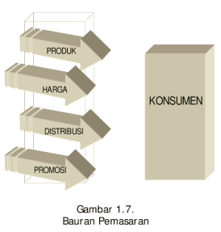
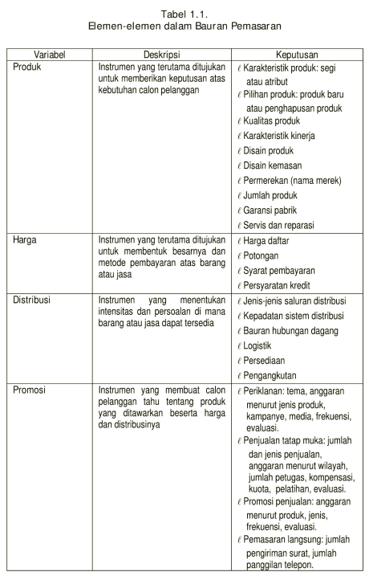

```{r setup, include=FALSE}
options(htmltools.dir.version = FALSE)
knitr::opts_chunk$set(
  fig.width=9, fig.height=3.5, fig.retina=3,
  out.width = "100%",
  cache = FALSE,
  echo = TRUE,
  message = FALSE, 
  warning = FALSE,
  hiline = TRUE
)
```

```{r xaringan-themer, include=FALSE, warning=FALSE}
library(xaringanthemer)
style_duo_accent(
  primary_color = "#1381B0",
  secondary_color = "#FF961C",
  inverse_header_color = "#FFFFFF"
)
```

```{r load_packages, message=FALSE, warning=FALSE, include=FALSE} 
library(fontawesome)
```

```{r xaringan-tile-view, echo=FALSE}
xaringanExtra::use_tile_view()
```

```{r xaringan-scribble, echo=FALSE}
xaringanExtra::use_scribble()
```
layout: true

<div class="my-footer"><span>bangtedy.github.io</span></div>

<!-- this adds the link footer to all slides, depends on my-footer class in css-->
---

#  LUARAN PEMBELAJARAN

Setelah mempelajari bab ini, mahasiswa diharapkan dapat: 
- Menjelaskan peran pemasaran yang dilakukan oleh manajer pemasaran dalam perusahaan dan oleh pemasar dalam masyarakat yang berada di lingkungan yang terus
berubah.

####  Lebih khusus lagi: mahasiswa diharapkan dapat menjelaskan:
1. Pengertian pemasaran dari segi sosial;
2. Pengertian pemasaran dari segi manajerial;
3. Peran pemasaran dalam perusahaan;
4. Konsep Pemasaran sebagai panduan filosofis dan praktis;
5. Tanggung jawab manajer pemasaran dalam perusahaan;
6. Peran pemasaran dalam masyarakat;
7. Tanggung jawab sosial;
8. Dimensi-dimensi tanggung jawab perusahaan;
9. Konsumerisme;
10. Pemasaran dalam lingkungan yang berubah.

---

#  Fungsi Bisnis

## Fungsi bisnis mana yang paling penting di perusahaan?

1. Produksi dan Operasi 
2. Akuntansi dan Keuangan
3. Pemasaran
4. Sumberdaya Manusia

---


# Apa saja yang dapat dipasarkan?

### 1. Barang
### 2. Jasa
### 3.
### 4.
### 5.

---

# Proses Pemasaran

- Dimulai dengan meriset pasar untuk memahami karakteristik dan perilaku konsumen dan untuk mengidentifikasi peluang guna memenuhi kebutuhan dan keinginan mereka.
  + Segmentasi pasar dan penentuan segmen pasar, dan posisi pasar untuk dapat secara tepat memenuhi kebutuhan dan keinginan konsumen dengan cara yang unggul. 
  + Mengapa segmentasi?
  + Formulasi strategi pemasaran dan mengimplementasikannya ke dalam pemasaran terpadu (kebijakan harga, produk, distribusi dan promosi) yang lebih rinci. 
  + Mengapa perlu strategi?

---


# Jadi Pemasaran itu ...

Kegiatan perencanaan, dan pelaksanaan strategi pemasaran dan evaluasi hasil untuk perbaikan-perbaikan
lebih lanjut.

### Apa bedanya dengan manajemen pemasaran?

---

# Manajemen Pemasaran

Manajemen pemasaran adalah seni dan ilmu memilih pasar sasaran dan mendapatkan, mempertahankan, dan menumbuhkan pelanggan melalui penciptaan, penyampaian dan pengomunikasian nilai pelanggan superior.

---


# Nilai pelanggan

Nilai pelanggan = Manfaat -Pengorbanan
( Customer Value = Benefit -Cost)

Nilai pelanggan superior: ...
 - contoh

---


# KONSEP PEMASARAN SEBAGAI FILOSOFI BISNIS

#### “Pelanggan adalah raja.”

#### “Setia melayani Anda.”

#### “Anda adalah bos.”

#### “Temukan keinginan mereka dan penuhilah.”

---

# Konsep Pemasaran sebagai filosofi bisnis

1. orientasi pelanggan;
2. koordinasi dan integrasi seluruh kegiatan pemasaran dalam perusahaan;
3. pencapaian tujuan kinerja organisasi, yaitu laba jangka panjang;
4. kinerja pemasaran yang lebih baik dibanding pesaing.

---


# DIMENSI-DIMENSI TANGGUNG JAWAB PERUSAHAAN

- Laba/keuntungan

- ....

- ...

- ...

---


# Konsumerisme
- Sejumlah aktivitas dari organisasi dan aktivis konsumen yang independen, dirancang untuk melindungi konsumen.
- Apa saja hak konsumen?

---


# LINGKUNGAN MAKROEKSTERN vs LINGKUNGAN MIKROEKSTERN

---
class: middle, center
# BAURAN PEMASARAN

```{r out.width = '35%', echo=FALSE}

```

---
class: middle, center
### ELEMEN BAURAN PEMASARAN
```{r out.width = '30%', echo=FALSE}

```
---

class: inverse, right, middle


# Find me at...

[`r fa(name = "twitter")` @t_hlb](http://twitter.com/t_hlb)  
[`r fa(name = "blog")` bangtedy.github.io](https://bangtedy.github.io)


