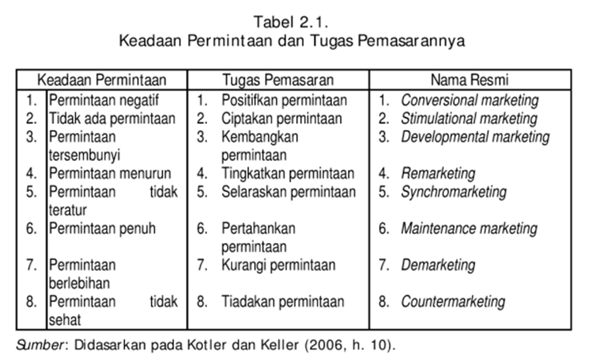
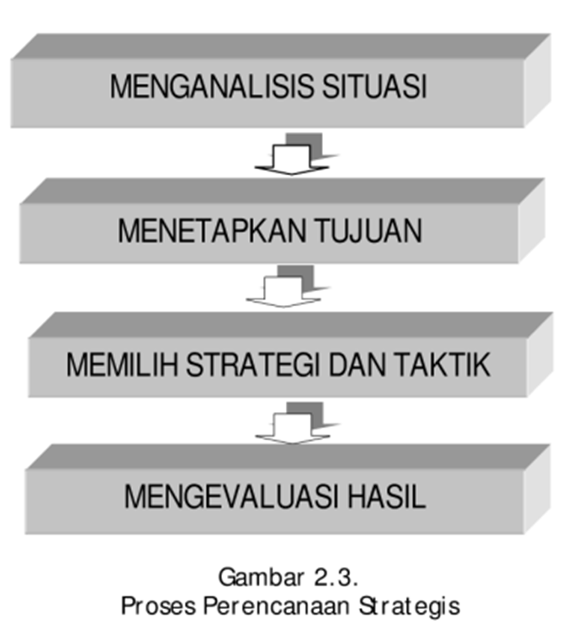
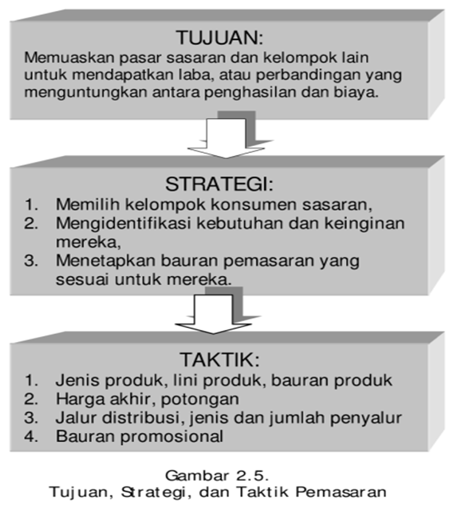
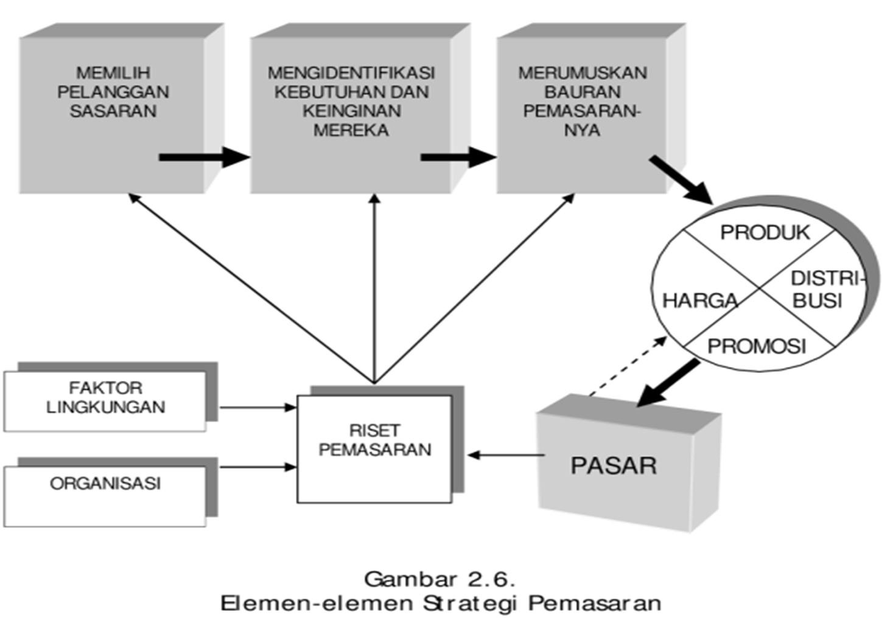
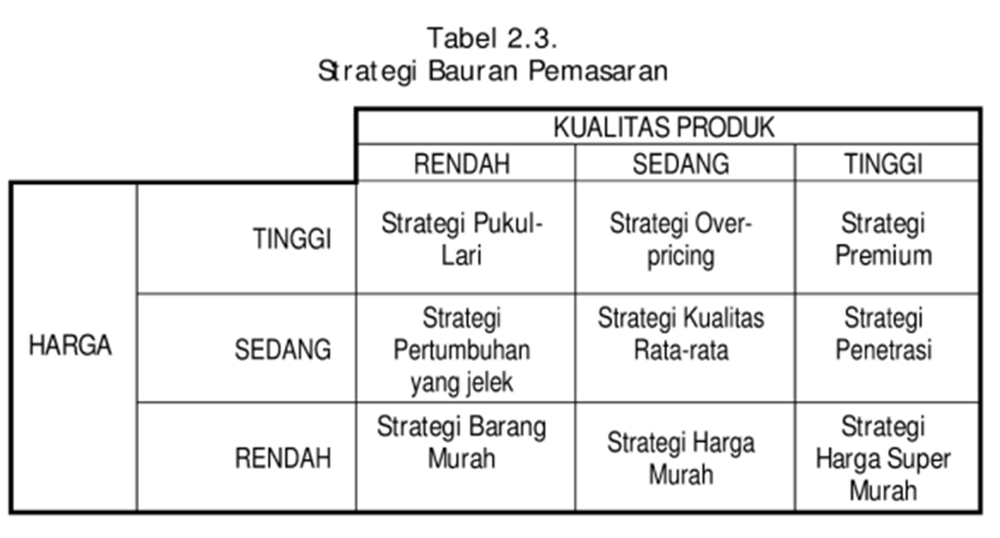

```{r setup, include=FALSE}
options(htmltools.dir.version = FALSE)
knitr::opts_chunk$set(
  fig.width=9, fig.height=3.5, fig.retina=3,
  out.width = "100%",
  cache = FALSE,
  echo = TRUE,
  message = FALSE, 
  warning = FALSE,
  hiline = TRUE
)
```

```{r xaringan-themer, include=FALSE, warning=FALSE}
library(xaringanthemer)
style_duo_accent(
  primary_color = "#1381B0",
  secondary_color = "#FF961C",
  inverse_header_color = "#FFFFFF"
)
```

```{r load_packages, message=FALSE, warning=FALSE, include=FALSE} 
library(fontawesome)
```

```{r xaringan-tile-view, echo=FALSE}
xaringanExtra::use_tile_view()
```

```{r xaringan-scribble, echo=FALSE}
xaringanExtra::use_scribble()
```
layout: true

<div class="my-footer"><span>bangtedy.github.io</span></div>

---

# Pendahuluan
Modul kedua ini membahas: 
- Uraian tentang berbagai macam tugas manajemen pemasaran dalam lingkungan yang sudah berubah
- Tahapan proses penyampaian nilai yang bermula dari penganalisisan pasar sampai dengan pengendalian pemasaran.
- Langkah-langkah penting yang harus dilakukan oleh seorang manajer pemasaran dalam merumuskan strategi pemasaran.

---

# Capaian Pembelajaran
Setelah mempelajari modul ini diharapkan Anda dapat menjelaskan:
1. tugas-tugas manajemen pemasaran dalam kondisi bisnis yang sudah berubah;
2. proses penyampaian nilai;
3. strategi pemasaran;
4. pengembangan strategi pemasaran.

---
## Tugas utama manajer pemasaran

- Mendapatkan pelanggan atau konsumen.
- Mempertahankan pelanggan seumur hidup.
- Menanggapi perubahan lingkungan termasuk persaingan.

> Tugas manajer pemasaran itu tidaklah sederhana, dimulai jauh sebelum produk itu dibuat dan …

> Tidak akan berakhir sampai produknya terjual.

---

## Rincian Tugas Manajer Pemasaran
.pull-left[
- Mengidentifikasi kebutuhan dan keinginan konsumen.
- Mengembangkan suatu konsep tentang suatu produk
- Mengadakan pengujian terhadap kecocokan konsep produk
- Membuat desain produk.
- Merancang kemasan merek.
- Menetapkan harga
]

.pull-right[
- Mengatur distribusi.
- Menciptakan komunikasi pemasaran
- Memeriksa penjualan.
- Memperhatikan dan memenuhi kepuasan konsumen.
- Membangun merek yang kuat.
- Menciptakan pertumbuhan jangka panjang.
]
---

## Kesimpulannya, seorang manajer berfungsi sebagai:
- peneliti
- psikolog
- sosiolog
- ekonom
- komunikator
- ahli hukum
- bahkan antropolog
- ADA LAGI?

---

## PENYEBAB PERUBAHAN DALAM PEMASARAN

.pull-left[
- Teknologi
- Globalisasi
- Deregulasi
- Privatisasi
- Pembedayaan pelanggan
- Customisasi
]

.pull-right[
- Persaingan ketat
- Konvergensi industry
- Transformasi ritel
- Disintermediasi
]

---

## PERUBAHAN DALAM MANAJEMEN PEMASARAN

- Dari bagian pemasaran melakukan pemasaran ke setiap orang melakukan pemasaran.
- Dari pengorganisasian berdasar produk ke pengorganisasian berdasar segmen pelanggan.
- Dari membuat segalanya ke membeli barang dan jasa lebih banyak dari pihak luar.
- Dari menggunakan banyak pemasok ke bekerja dengan lebih sedikit pemasok dalam kerangka kemitraan.

---

## PERUBAHAN DALAM MANAJEMEN PEMASARAN (lanjutan)
- Dari penekanan pada posisi pasar lama ke pasar baru yang belum terliput.
- Dari penekanan pada aset kentara ke penekanan pada aset tidak kentara.
- Dari membangun merek melalui periklanan ke membangun merek melalui kinerja dan komunikasi terpadu.
- Dari menarik pelanggan melalui toko dan tenaga penjualan ke penyediaan produk secara online.

---

class: middle, center

```{r out.width = '80%', echo=FALSE}

```

---

class: middle, center

```{r out.width = '50%', echo=FALSE}

```

---
class: middle, center

```{r out.width = '50%', echo=FALSE}

```
---

class: middle, center

```{r out.width = '80%', echo=FALSE}

```

---

class: middle, center

```{r out.width = '80%', echo=FALSE}

```
---

## Latihan

1. Cukup banyak tugas manajer pemasaran. Salah satu tugas utamanya adalah mengatur permintaan. Bagaimanakah seorang manajer pemasaran mengatur permintaan?
2. Uraikan tahap-tahap dalam proses manajemen pemasaran!
3. Apakah yang dimaksud dengan strategi pemasaran dan bagaimana
perumusannya?

---

class: inverse, right, middle


# Find me at...

[`r fa(name = "twitter")` @t_hlb](http://twitter.com/t_hlb)  
[`r fa(name = "blog")` bangtedy.github.io](https://bangtedy.github.io)


