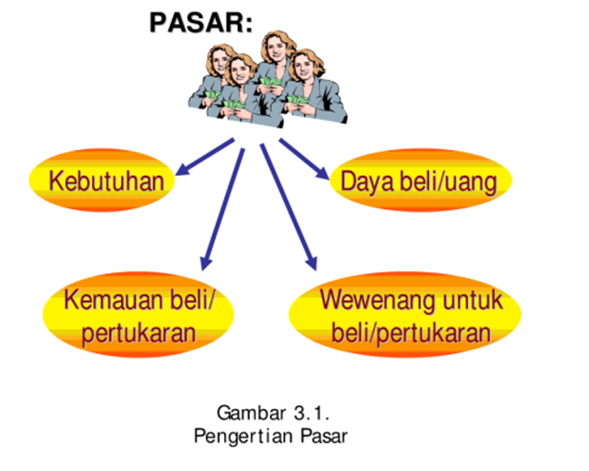
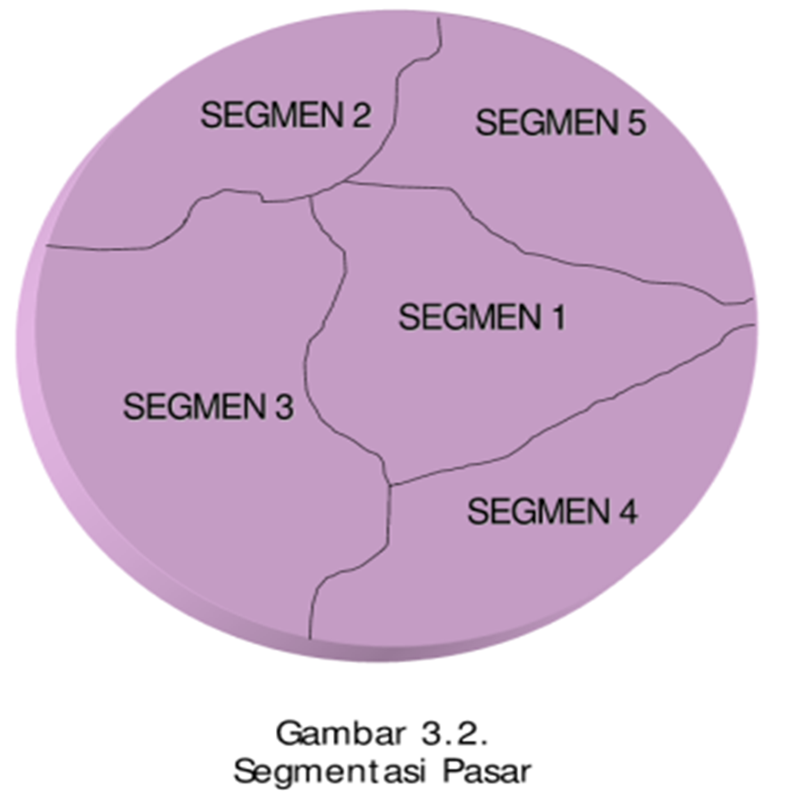
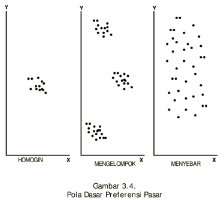
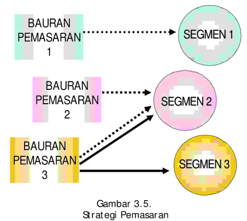

```{r setup, echo = F}
knitr::opts_chunk$set(
  comment = "#",
  #cache = TRUE,
  collapse = TRUE,
  warning = FALSE,
  message = FALSE,
  fig.width = 7,
  fig.height = 5.25,
  fig.align = 'center',
  fig.retina = 3
)

# base plot layout
mypar = list(mar = c(3,3,0.5,0.5), mgp = c(1.5, 0.3, 0), tck = -.008)

# xaringan Extra
xaringanExtra::use_xaringan_extra(c("tile_view", "animate_css", "tachyons"))
xaringanExtra::use_extra_styles(
  hover_code_line = TRUE,         #<<
  mute_unhighlighted_code = TRUE  #<<
)
xaringanExtra::use_editable(expires = 1)
xaringanExtra::use_panelset()
xaringanExtra::use_scribble()
```
class: middle, title-slide

<!-- top logo (comment to remove or edit on `conf/css/style.css:23`) -->
<div class="lab-logo"></div>
<!-- <div class="uni-logo"></div> -->

# Segmentasi, Penargetan dan Pemosisian
<hr width="100%" align="left" size="0.3" color="yellow"></hr>
## <span style="color:gold">Sesi 3</span>
### Tedy Herlambang .small[<br> + Manajemen Pemasaran]

<br><br><br><br>
[<i class="fas fa-blog" style="color:#e7e8e2"></i> bangtedy.github.io](https://bangtedy.github.io)

[<i class="fa fa-twitter fa-lg" style="color:#e7e8e2"></i> @t_hlb](https://twitter.com/t_hlb)

---

# Pendahuluan

Setelah mempelajari modul 3 ini diharapkan Anda mampu menjelaskan tentang cara-cara dan berbagai aspek tentang segmentasi pasar, penargetan pasar atau penentuan pasar sasaran dan pemosisian produk. Secara khusus, Anda diharapkan mampu:

1. Menjelaskan pengertian pasar;
2. Menjelaskan pengelompokan pasar;
3. Menjelaskan pengertian diferensiasi produk;
4. Menjelaskan pengertian segmentasi pasar;
5. Menjelaskan kriteria atau faktor-faktor dalam mensegmentasikan pasar;
6. Menganalisis strategi penargetan pasar;
7. Menjelaskan pengertian pemosisian produk;
8. Menjelaskan strategi pemosisian produk;
9. Menjelaskan strategi pemasaran perusahaan dalam melayani segmen pasarnya. 

---
class: middle, center, inverse

# PASAR DAN PENGGOLONGANNYA
<hr width="100%" align="left" size="0.3" color="yellow"></hr>

---
# Pengertian Pasar
Pasar adalah semua pelanggan dan pelanggan potensial yang mempunyai:
1. kebutuhan umum yang sama yang dapat dipenuhi dengan suatu produk
yang spesifik;
2. sumber-sumber (uang, barang) untuk dipertukarkan;
3. kemauan untuk menciptakan pertukaran; dan
4. wewenang untuk menciptakan pertukaran.

Menurut Churchill: orang-orang dan lembaga-lembaga yang mempunyai keinginan dan kemampuan untuk membeli barang atau jasa tertentu

---


---
# <span style="color:blue">Penggolongan Pasar</span>
1. <span style="color:gold">Pasar Konsumen</span>: Pasar konsumen terdiri atas individu-individu dan rumah tangga yang membeli barang dan jasa untuk konsumsi pribadi
2. <span style="color:gold">Pasar Bisnis</span>: Pasar bisnis membeli barang dan jasa untuk pengolahan lebih lanjut atau untuk digunakan dalam proses produksi.
3. <span style="color:gold">Pasar Penjual</span>: Pasar penjual membeli barang dan jasa untuk dijual kembali guna
memperoleh laba.
4. <span style="color:gold">Pasar Pemerintah</span>: Pasar pemerintah terdiri atas lembaga-lembaga pemerintahan yang
membeli barang dan jasa untuk menghasilkan pelayanan publik atau memindahkan barang dan jasa kepada pihak lain yang membutuhkannya
5. <span style="color:gold">Pasar Internasional</span>: Pasar internasional mencakup pembeli-pembeli di negara-negara lain, termasuk konsumen, produsen, penjual, dan pemerintah

---

#  PEMBEDAAN/DIFERENSIASI PRODUK
- Pembedaan produk (*product differentiation*) merupakan dasar bagi
penjual dalam menentukan motif-motif pembelian selektif. 
- Pemasar yang menerapkan pembedaan produk berupaya untuk memfokuskan perbedaan-perbedaan produknya agar menarik pembeli. 
- Konsep ini berbeda dengan segmentasi pasar (dibahas kemudian) yang memfokuskan pada kelompok-kelompok pelanggan untuk kemudian dilayani dengan baik. 
- Pembedaan produk itu merupakan suatu strategi yang dimaksudkan untuk menarik perhatian para pembeli pada aspek-aspek yang ada pada sebuah produk yang dianggap berbeda dari pesaing

---

class: middle, center, inverse

# SEGMENTASI PASAR
<hr width="100%" align="left" size="1.5" color="gold"></hr>

---

---

class: middle, center, inverse

# KRITERIA SEGMENTASI
<hr width="100%" align="left" size="1.5" color="yellow"></hr>

---
# Kriteria Segmentasi

- Faktor demografis geografis: lokasi, transportasi, desa/kota dll
- Faktor demografis pribadi: umur, jenis kelamin, mobilitas, penghasilan, pekerjaan, status perkawinan
- Faktor psikografis dan keperilakuan: kepribadian, sikap, manfaat produk yang diinginkan, persepsi, loyalitas merek

---

class: middle, center, inverse
# PERSYARATAN UNTUK MELAKUKAN SEGMENTASI PASAR YANG EFEKTIF
<hr width="100%" align="left" size="1.5" color="yellow"></hr>

---
# PERSYARATAN UNTUK MELAKUKAN SEGMENTASI PASAR YANG EFEKTIF
- Dapat diukur (*measurability*)
- Dapat dimasuki (*accessibility*)
- Cukup besar (*substantiality*)
- Dapat dibedakan (*differentiability*)
- Dapat ditindaklanjuti (*actionability*)


---
# PENENTUAN PASAR SASARAN
1. Undifferentiated Marketing
2. Differentiated Marketing
3. Concentrated Marketing

---
# HUBUNGAN ANTARA PENARGETAN PASAR DENGAN SEGMENTASI PASAR
1. Preferensi yang homogen
2. Preferensi yang menyebar
3. Preferensi yang mengelompok



---
# PEMILIHAN STRATEGI PENARGETAN PASAR
1. Sumber-sumber yang dimiliki perusahaan
2. Homogenitas produk
3. Tahap-tahap dalam daur hidup produk
4. Homogenitas Pasar
5. Strategi Pemasaran Saingan

---
# STRATEGI PEMOSISIAN PRODUK
1. Pemosisian Ulang Produk
2. Perluasan Merek

---
# Strategi Pemasaran
1. Strategi penetrasi pasar
2. Strategi pengembangan produk
3. Strategi pengembangan pasar



---
class: inverse, middle, center

# <span style="color:gold">Terima kasih</span>


