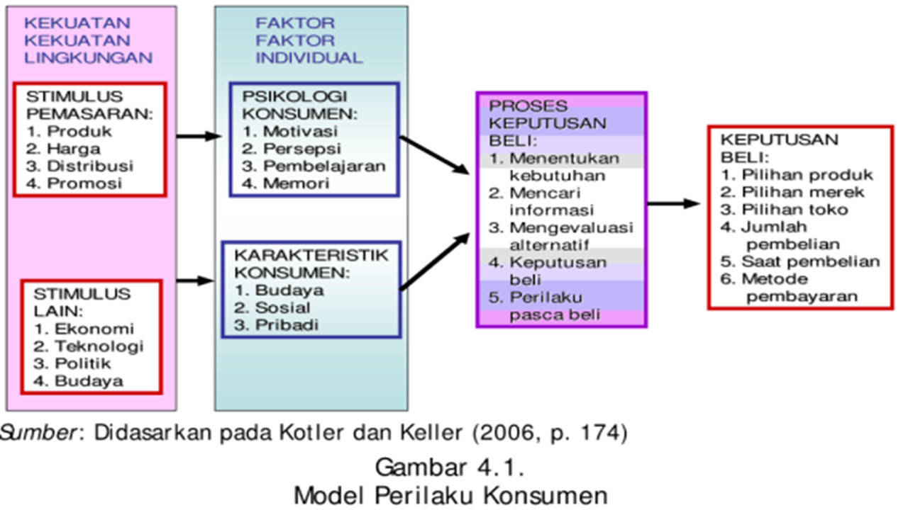
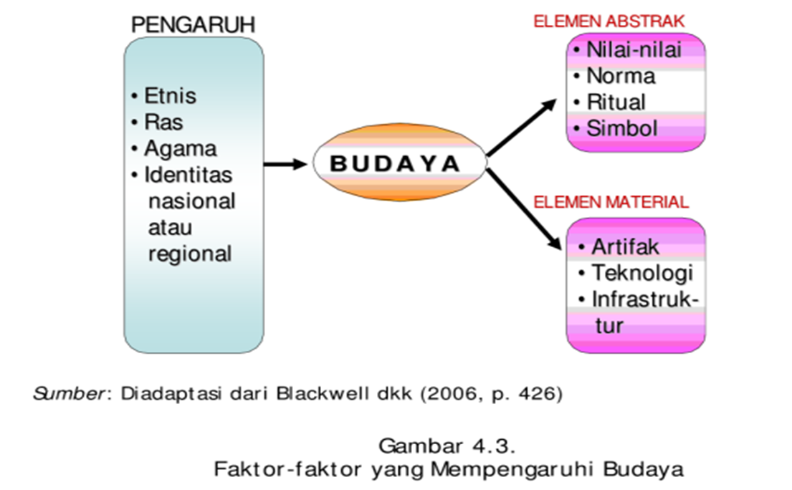
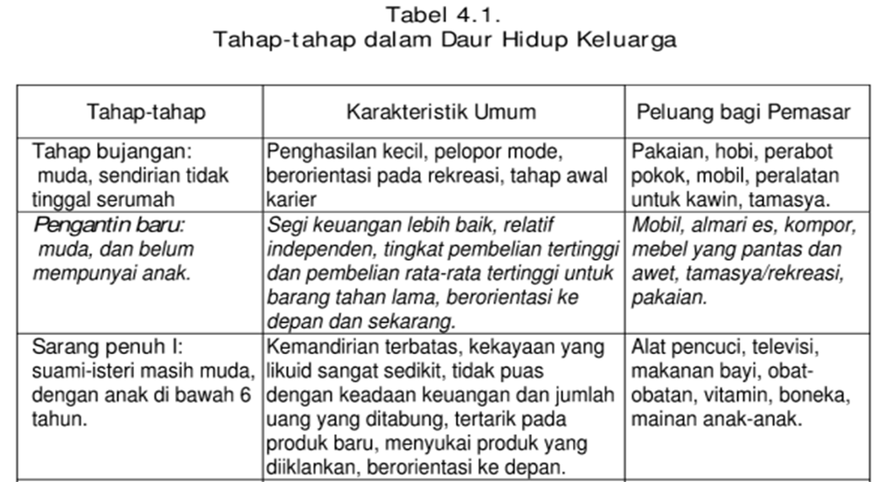
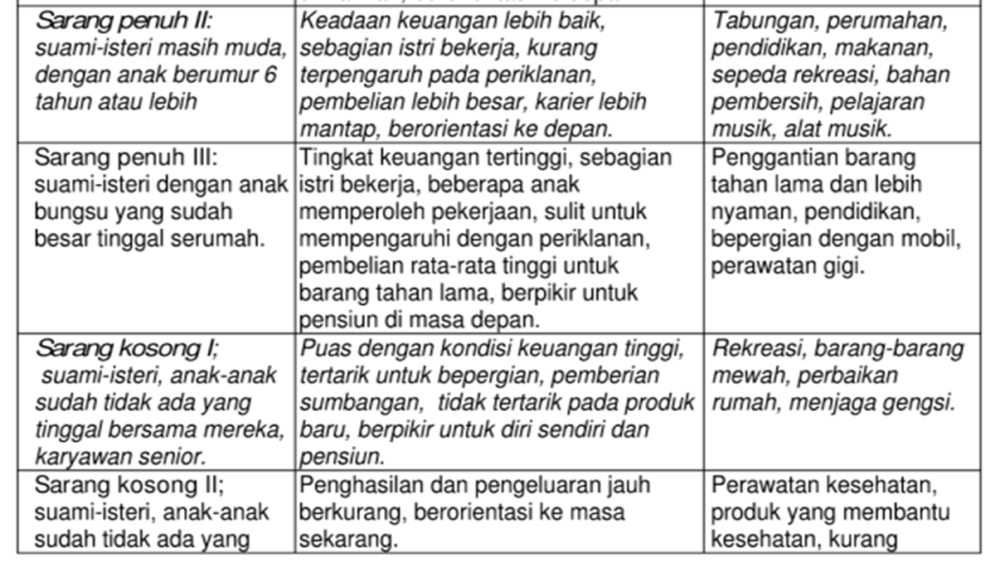
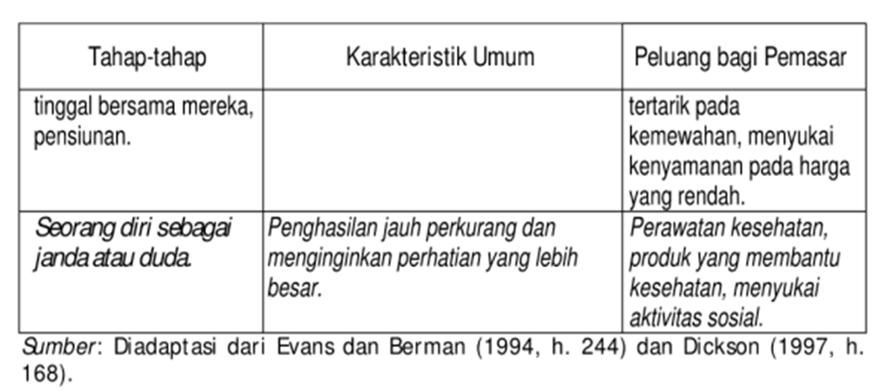
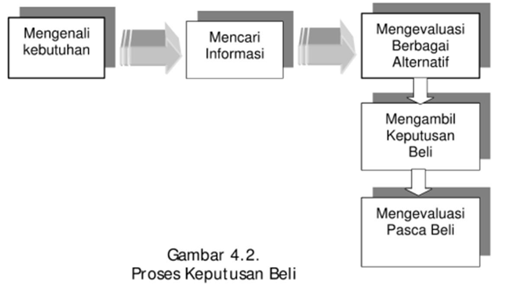
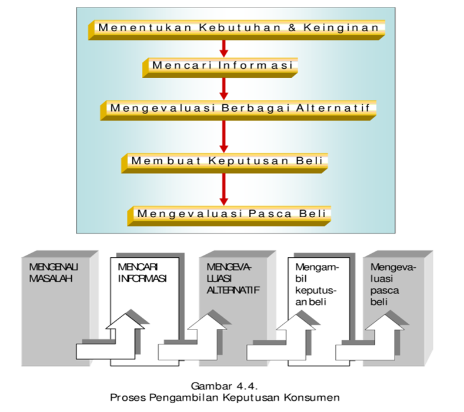
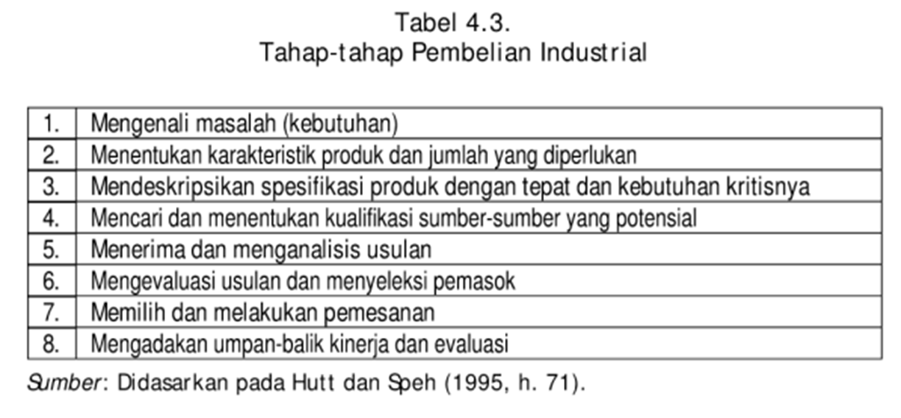

```{r setup, echo = F}
knitr::opts_chunk$set(
  comment = "#",
  #cache = TRUE,
  collapse = TRUE,
  warning = FALSE,
  message = FALSE,
  fig.width = 7,
  fig.height = 5.25,
  fig.align = 'center',
  fig.retina = 3
)

# base plot layout
mypar = list(mar = c(3,3,0.5,0.5), mgp = c(1.5, 0.3, 0), tck = -.008)

# xaringan Extra
xaringanExtra::use_xaringan_extra(c("tile_view", "animate_css", "tachyons"))
xaringanExtra::use_extra_styles(
  hover_code_line = TRUE,         #<<
  mute_unhighlighted_code = TRUE  #<<
)
xaringanExtra::use_editable(expires = 1)
xaringanExtra::use_panelset()
xaringanExtra::use_scribble()
```
class: middle, title-slide

<!-- top logo (comment to remove or edit on `conf/css/style.css:23`) -->
<div class="lab-logo"></div>
<!-- <div class="uni-logo"></div> -->

# Menganalisis Perilaku Konsumen
<hr width="100%" align="left" size="0.3" color="yellow"></hr>
## <span style="color:gold">Manajemen Pemasaran Sesi 4</span>
### Tedy Herlambang .small[<br>]

<br><br><br><br><br>
[<i class="fas fa-blog" style="color:#e7e8e2"></i> bangtedy.github.io](https://bangtedy.github.io)

[<i class="fa fa-twitter fa-lg" style="color:#e7e8e2"></i> @t_hlb](https://twitter.com/t_hlb)
---

# Pendahuluan

Modul 4 mencakup pokok-pokok materi:
(1) deskripsi dan model perilaku konsumen, dan (2) perilaku pembeli
industrial. Materi yang dibahas cukup luas, maka Anda disarankan untuk
memperdalam kajian semua aspek yang dibahas dengan cara mempelajari
literatur lain yang berkaitan.

Setelah mempelajari modul ini, diharapkan Anda mampu menganalisis
perilaku konsumen serta perilaku pembeli industrial. Lebih khusus lagi,
setelah mempelajari modul ini diharapkan Anda dapat:

1. menjelaskan deskripsi perilaku konsumen;
2. menjelaskan model perilaku konsumen;
3. menganalisis faktor-faktor yang mempengaruhi proses keputusan beli konsumen;
4. menjelaskan berbagai macam situasi pembelian pada pasar konsumen;
5. menjelaskan struktur keputusan beli konsumen;
6. menganalisis proses pengambilan keputusan konsumen;
7. menjelaskan perilaku pembeli industrial;
8. menjelaskan proses keputusan pembelian industrial;
9. menjelaskan situasi pembelian industrial;
10. menjelaskan berbagai pendekatan pembelian industrial.

---
# Perilaku konsumen

Proses mental dan emosional serta aktivitas fisik yang dilakukan oleh individu-individu ketika mereka memilih, membeli, menggunakan, dan mengatur barang dan jasa untuk memuaskan kebutuhan dan keinginan tertentu (Bearden dkk, 1995, p. 106)

---

---
# Pertanyaan-pertanyaan berikut sangat penting untuk memahami perilaku konsumen:

- Apa yang mereka beli?
- Dimana mereka beli?
- Bagaimana mereka membeli?
- Seberapa banyak mereka membeli?
- Kapan mereka membeli?
- Mengapa mereka membeli?

---
# Faktor-factor yang mempengaruhi keputusan membeli (1): 

Stimulus atau kekuatan - kekuatan lingkungan:

- budaya, 
- sub-budaya, 
- kelas sosial, 
- kelompok referensi, 
- keluarga, 
- faktor-faktor situasional, 
- nilai-nilai, norma, dan peranan sosial, dan 
- variabel-variabel bauran pemasaran; 

---


---

---


---


---
# Faktor-factor yang mempengaruhi keputusan membeli (2): 

- persepsi, 
- motif, 
- pengolahan informasi, 
- pembelajaran, 
- sikap dan keyakinan, 
- kepribadian. 
- pengalaman, dan 
- konsep diri.

---


---


---
class: center


---

class: inverse, right, bottom

# Matur nuwun, find me at...
<hr width="45%" align="right" size="0.3" color="orange"></hr>

[<i class="fa fa-twitter fa-lg" style="color:#e7e8e2"></i> <span style="color:#fc911e"> @t_hlb </span>](https://twitter.com/t_hlb)

[<i class="fas fa-blog" style="color:#fc911e"></i><span style="color:#e7e8e2"> bangtedy.github.io</span>](https://bangtedy.github.io)

