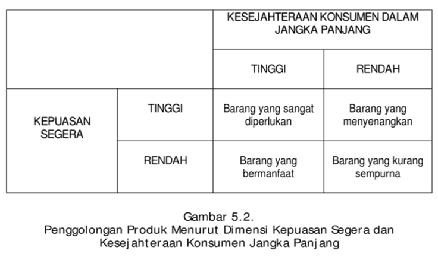

```{r setup, echo = F}
knitr::opts_chunk$set(
  comment = "#",
  #cache = TRUE,
  collapse = TRUE,
  warning = FALSE,
  message = FALSE,
  fig.width = 7,
  fig.height = 5.25,
  fig.align = 'center',
  fig.retina = 3
)

# base plot layout
mypar = list(mar = c(3,3,0.5,0.5), mgp = c(1.5, 0.3, 0), tck = -.008)

# xaringan Extra
xaringanExtra::use_xaringan_extra(c("tile_view", "animate_css", "tachyons"))
xaringanExtra::use_extra_styles(
  hover_code_line = TRUE,         #<<
  mute_unhighlighted_code = TRUE  #<<
)
xaringanExtra::use_editable(expires = 1)
xaringanExtra::use_panelset()
xaringanExtra::use_scribble()
```
class: middle, title-slide

<!-- top logo (comment to remove or edit on `conf/css/style.css:23`) -->
<div class="lab-logo"></div>
<!-- <div class="uni-logo"></div> -->

# Pengelolaan Produk dan Pengembangan Produk Baru
<hr width="100%" align="left" size="0.3" color="yellow"></hr>
## <span style="color:gold">Manajemen Pemasaran Sesi 5</span>
### Tedy Herlambang .small[<br>]

<br><br><br><br><br>
[<i class="fas fa-blog" style="color:#e7e8e2"></i> bangtedy.github.io](https://bangtedy.github.io)

[<i class="fa fa-twitter fa-lg" style="color:#e7e8e2"></i> @t_hlb](https://twitter.com/t_hlb)
---

# Pendahuluan

Setelah mempelajari modul ini, diharapkan Anda mampu menjelaskan tentang pengelolaan produk dan pengembangan produk baru. Lebih khusus lagi, setelah mempelajari modul ini diharapkan Anda dapat:

1  pengertian produk;
2. konsep barang dan jasa;
3. penggolongan produk melalui berbagai pendekatan;
4. penggolongan produk industrial;
5. pertimbangan pemasaran pada produk konsumen;
6. strategi pemasaran pada produk konsumen dan industrial;
7. tahapan pengembangan produk mulai dari pencarian ide sampai dengan komersialisasi.


---
# ARTI PRODUK BAGI KONSUMEN

- Nasi goreng
- Bank BRI
- Skin care
- Twitter

---
# Produk
- Produk diartikan sebagai segala sesuatu yang dapat ditawarkan ke sebuah pasar untuk memuaskan keinginan dan kebutuhan (Kotler dan Keller, 2006, p . 344) .
- Produk juga dapat didefinisikan sebagai tawaran pemuasan kebutuhan dari sebuah perusahaan (Perreault and McCarthy, 2005,p. 242).
- Produk adalah suatu barang yang mempunyai sifat kentara, suatu jasa, sebuah ide, atau kombinasinya, yang dapat memenuhi kebutuhan konsumen maupun pelanggan bisnis melalui suatu pertukaran; juga diartikan sebagai sejumlah atribut yang mencakup fitur, fungsi, manfaat, dan penggunaan (Solomon and Stuart, 1997, p. 294).
-- > kombinasi dari barang, jasa, dan ide.

---

# BARANG DAN JASA

- Barang dapat diartikan sebagai suatu produk yang kentara, artinya, dapat dilihat, disentuh, dicium, dan/atau dirasakan.
- Jasa diartikan sebagai suatu produk yang tidak kentara, seperti pengangkutan dengan kereta, penginapan di hotel, pinjaman bank, atau rias rambut, yang dipertukarkan secara langsung dari produsen ke konsumen.


---


---

---
# Penggolongan Produk Menurut Tujuan Pemakaiannya

- Produk konsumen
  - Produk konvenien ( convenience products)
  - Produk shopping ( shopping products)
  - Produk spesial ( specialty products).
- Produk industrial
  - Bahan baku
  - Komponen dan produk setengah jadi
  - Perlengkapan operasi ( operating supplies)
  - Instalasi
  - Peralatan ekstra


---


---


---


---


---
.pull-left[

]

.pull-right[


]
---
.pull-left[


]

.pull-right[


]
---

class: inverse, right, bottom

# Matur nuwun, find me at...
<hr width="45%" align="right" size="0.3" color="orange"></hr>

[<i class="fa fa-twitter fa-lg" style="color:#e7e8e2"></i> <span style="color:#fc911e"> @t_hlb </span>](https://twitter.com/t_hlb)

[<i class="fas fa-blog" style="color:#fc911e"></i><span style="color:#e7e8e2"> bangtedy.github.io</span>](https://bangtedy.github.io)

