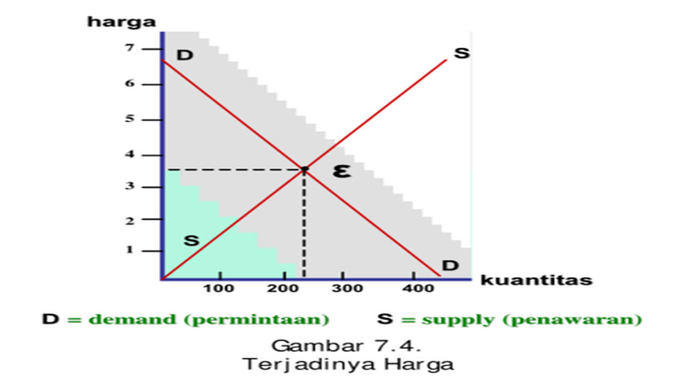

```{r setup, echo = F}
knitr::opts_chunk$set(
  comment = "#",
  #cache = TRUE,
  collapse = TRUE,
  warning = FALSE,
  message = FALSE,
  fig.width = 7,
  fig.height = 5.25,
  fig.align = 'center',
  fig.retina = 3
)

# base plot layout
mypar = list(mar = c(3,3,0.5,0.5), mgp = c(1.5, 0.3, 0), tck = -.008)

# xaringan Extra
xaringanExtra::use_xaringan_extra(c("tile_view", "animate_css", "tachyons"))
xaringanExtra::use_extra_styles(
  hover_code_line = TRUE,         #<<
  mute_unhighlighted_code = TRUE  #<<
)
xaringanExtra::use_editable(expires = 1)
xaringanExtra::use_panelset()
xaringanExtra::use_scribble()
```
class: middle, title-slide

<!-- top logo (comment to remove or edit on `conf/css/style.css:23`) -->
<div class="lab-logo"></div>
<!-- <div class="uni-logo"></div> -->

# Strategi Penetapan Harga
<hr width="100%" align="left" size="0.3" color="yellow"></hr>
## <span style="color:gold">Manajemen Pemasaran Sesi 6</span>
### Tedy Herlambang .small[<br>]

<br><br><br><br><br>
[<i class="fas fa-blog" style="color:#e7e8e2"></i> bangtedy.github.io](https://bangtedy.github.io)

[<i class="fa fa-twitter fa-lg" style="color:#e7e8e2"></i> @t_hlb](https://twitter.com/t_hlb)
---

# Pendahuluan

> Modul 7 mencakup pokok-pokok materi:
1. pengertian dan penetapan harga
2. metode praktis penetapan harga sebagai bagian dari manajemen pemasaran
3. strategi penetapan harga yang didasarkan pada permintaan.

Setelah mempelajari modul ini, diharapkan Anda mampu menganalisis strategi penetapan harga berdasarkan permintaan. Lebih khusus lagi, setelah mempelajari modul ini diharapkan Anda dapat:

1. menjelaskan pengertian harga dalam konteks pemasaran;
2. menjelaskan peran harga dalam bauran pemasaran;
3. menjelaskan faktor-faktor yang mempengaruhi tingkat harga;
4. menjelaskan keputusan dan proses penetapan harga;
5. menjelaskan metode praktis penetapan harga sebagai bagian dari
manajemen pemasaran;
6. menganalisis strategi harga untuk mencapai pasar sasaran.
---
# APAKAH YANG DIMAKSUD DENGAN HARGA?

>- Harga adalah sejumlah uang yang dikeluarkan dalam pertukaran untuk mendapatkan barang atau jasa (McDaniel, et al., 2008, h . 538). 
- Dengan kata lain, harga itu merupakan apa yang dibayarkan konsumen untuk mendapatkan sesuatu .

---
# Dari sisi konsumen, harga adalah
Ongkos atau pengeluaran, bahkan secara luas diartikan sebagai pengorbanan:
- waktu mengantre untuk mendapatkan barang atau layanan, misalnya mengantre di sebuah bank;

- energi yang dikeluarkan konsumen saat mengantre sehingga kadang-kadang terasa capai;
- pengorbanan psikis karena situasi yang gerah, gaduh, bau kurang sedap, kotor, dan bahkan perangai pengantre lain yang tidak menyenangkan;

- angka rupiah yang harus dibayar, tercantum pada label harga.

---
# Dari sisi penjual, harga…
> Harapan penjual agar  dapat memperoleh sejumlah keuntungan

---
# Dalam praktik, harga tidak selalu dinyatakan secara jelas


---


---


---


---



---
# Elastisitas Permintaan 

- Inelastis
- Elastis
- Unitary elasticity


---
# Persaingan
- Persaingan sempuma
- Persaingan tidak sempuma
  - Monopoli
  - Oligopoli
  - Persaingan monopolistik

---
# Biaya
- Biaya merupakan dasar dalam penentuan harga, sebab suatu tingkat harga yang tidak dapat menutup biaya akan mengakibatkan kerugian.
- Sebaliknya, apabila suatu tingkat harga melebihi semua biaya, baik biaya produksi, biaya operasi maupun biaya non operasi, akan menghasilkan keuntungan.

---
# Tujuan Perusahaan

1. laba maksimum,
2. volume penjualan tertentu,
3. penguasaan pasar atau pangsa pasar tertentu, dan
4. kembalinya modal yang tertanam dalam jangka waktu tertentu.

---


---


---


---
class: inverse, right, bottom

# Matur nuwun, find me at...
<hr width="45%" align="right" size="0.3" color="orange"></hr>

[<i class="fa fa-twitter fa-lg" style="color:#e7e8e2"></i> <span style="color:#fc911e"> @t_hlb </span>](https://twitter.com/t_hlb)

[<i class="fas fa-blog" style="color:#fc911e"></i><span style="color:#e7e8e2"> bangtedy.github.io</span>](https://bangtedy.github.io)

