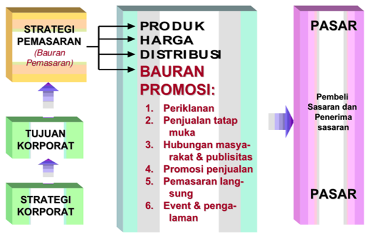
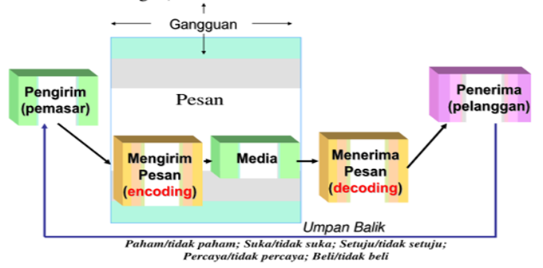
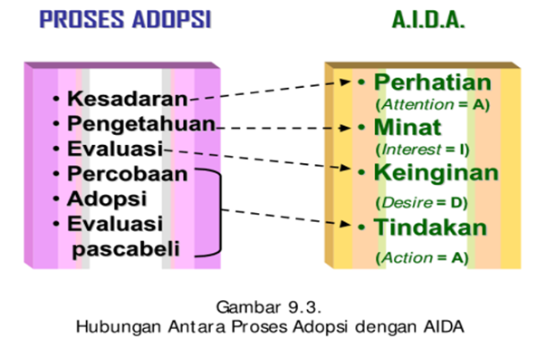
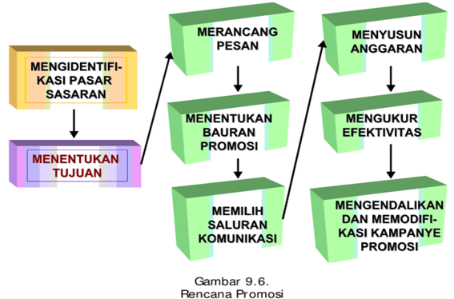

```{r setup, echo = F}
knitr::opts_chunk$set(
  comment = "#",
  #cache = TRUE,
  collapse = TRUE,
  warning = FALSE,
  message = FALSE,
  fig.width = 7,
  fig.height = 5.25,
  fig.align = 'center',
  fig.retina = 3
)

# base plot layout
mypar = list(mar = c(3,3,0.5,0.5), mgp = c(1.5, 0.3, 0), tck = -.008)

# xaringan Extra
xaringanExtra::use_xaringan_extra(c("tile_view", "animate_css", "tachyons"))
xaringanExtra::use_extra_styles(
  hover_code_line = TRUE,         #<<
  mute_unhighlighted_code = TRUE  #<<
)
xaringanExtra::use_editable(expires = 1)
xaringanExtra::use_panelset()
xaringanExtra::use_scribble()
```
class: middle, title-slide

<!-- top logo (comment to remove or edit on `conf/css/style.css:23`) -->
<div class="lab-logo"></div>
<!-- <div class="uni-logo"></div> -->

# Strategi Promosi dan Periklanan
<hr width="100%" align="left" size="0.3" color="yellow"></hr>
## <span style="color:gold">Manajemen Pemasaran Sesi 8</span>
### Tedy Herlambang .small[<br>]

<br><br><br><br><br>
[<i class="fas fa-blog" style="color:#e7e8e2"></i> bangtedy.github.io](https://bangtedy.github.io)

[<i class="fa fa-twitter fa-lg" style="color:#e7e8e2"></i> @t_hlb](https://twitter.com/t_hlb)
---

# PENDAHULUAN

Kemampuan umum yang diharapkan setelah mempelajari modul ini adalah Anda mampu menganalisis strategi promosi dan strategi periklanan sebagai salah satu komponen bauran pemasaran yang dikembangkan untuk melayani kebutuhan dan keinginan konsumen. Secara khusus Anda diharapkan dapat:

1. menjelaskan pengertian komunikasi pemasaran terbaru;
2. menjelaskan bauran promosi;
3. menjelaskan peluang untuk periklanan;
4. menjelaskan tujuan periklanan;
5. menganalisis pemilihan media. 

---
# Marketing Communications

- The means by which firms attempt to inform, persuade, and remind  consumers—directly or indirectly—about the products and brands they sell.
- They work by showing consumers how and why a product is used, by whom, where, and when.
- Consumers can learn who makes the product and what the company and brand stand for, and they can become motivated to try or use  it.  
- They allow companies to link their brands to other people, places, events, brands, experiences, feelings, and things.

---

---


# Marketing Communications Mix 

- Online and social media marketing—Online activities and programs designed to engage customers or prospects and directly or indirectly raise awareness, improve image, or elicit sales of products and services.
- Mobile  marketing—A  special  form  of  online  marketing  that  places  communications on consumer’s cell phones, smart phones, or tablets.
- Direct and database marketing—Use of mail, telephone, fax, e-mail, or internet to communicate directly with or solicit response 


---




---


---



---

# FAKTOR FAKTOR YANG MEMPENGARUHI BAURAN PROMOSI

- jumlah dana
- sifat pasar
- jenis produk
- tahapan dalam daur hidup produk


---

# JENIS ADVERTISING

- Pull Demand Advertising/ Costumer Advertising: Ditujukan kepada pembeli akhir agar permintaan prosuk meningkat, pasar sasarannya adalah konsumen akhir
- Push Demand Advertising/ Trade Advertising: Ditujukan kepada penyalur biasanya berupa barang industrial, pasar sasarannya adalah penyalur


---

class: inverse, right, bottom

# Matur nuwun, find me at...
<hr width="45%" align="right" size="0.3" color="orange"></hr>

[<i class="fa fa-twitter fa-lg" style="color:#e7e8e2"></i> <span style="color:#fc911e"> @t_hlb </span>](https://twitter.com/t_hlb)

[<i class="fas fa-blog" style="color:#fc911e"></i><span style="color:#e7e8e2"> bangtedy.github.io</span>](https://bangtedy.github.io)

